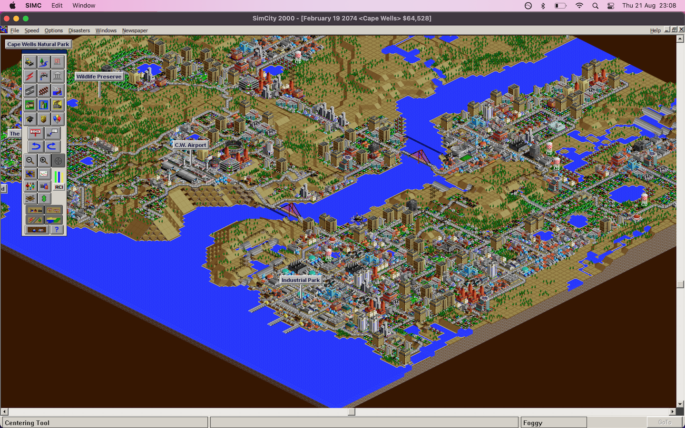
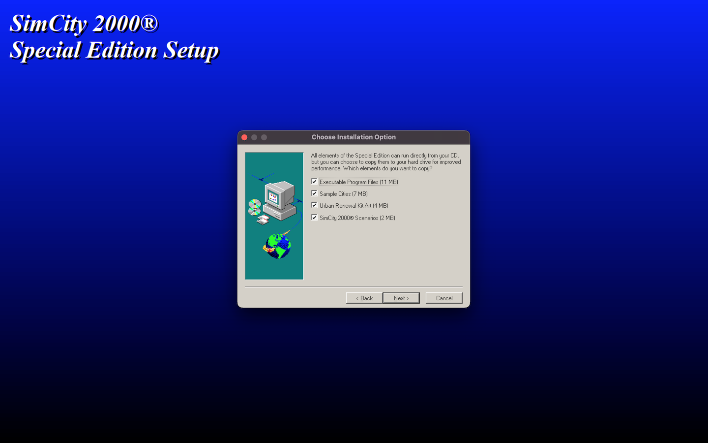
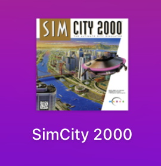
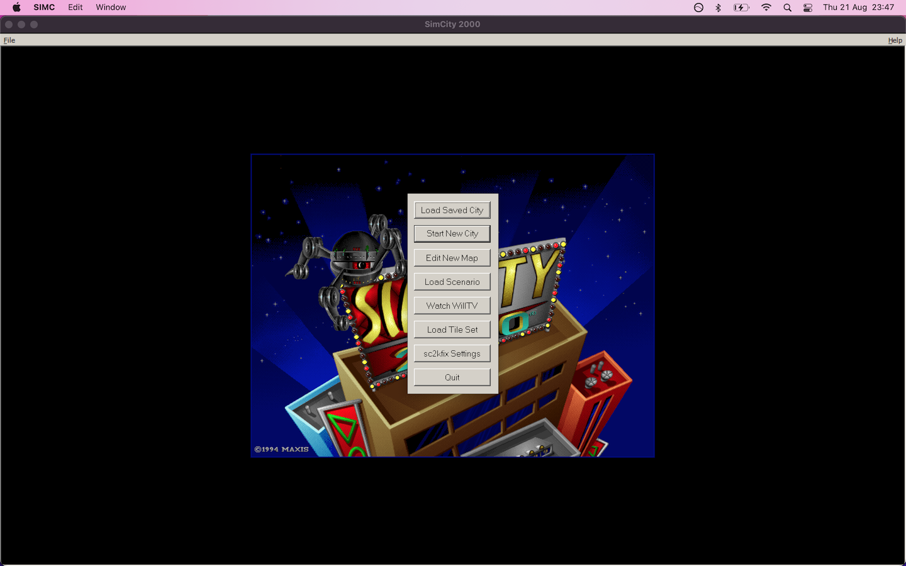

# How to run SimCity 2000 Special Edition on macOS in 2025

[GOG](https://www.gog.com/en/game/simcity_2000_special_edition) sells SimCity 2000 Special Edition, but it's the MS-DOS version bundled with DOSBox which is restricted to 640 x 480 resolution. The advantage of the Windows 95 version is that it can make full use of a larger monitor resolution.

This should be easy, [Wine](https://www.winehq.org/) can run Windows software after all, and Rosetta 2 will take care of translating Intel instructions to ARM on Apple Silicon processors. However there are several complications:
- Apple removed 32-bit binary support from macOS 10.15 Catalina onwards. This means modern macOS can no longer run 32-bit executables natively.
- To work around this, Wine must be compiled in 64-bit mode with WOW64 support. WOW64 (“Windows-on-Windows 64-bit”) is a compatibility layer inside Windows (and now Wine) which allows 32-bit Windows applications to run inside a 64-bit environment.
- While SimCity 2000 is 32-bit code, its installer is a 16-bit executable which WOW64 cannot run. We will need to replace this.
- The game has compatibility issues with current Wine 64-bit builds (smackw32.dll fails to initialise).
- The game has other issues which need fixing:
  - palette cycling animation issues
  - load/save issues
  - game window initialises with an invisible size

## Wine versions

#### Official ❌
Wine binaries seem to be difficult to obtain. The usual method to install is to use the [brew package manager](https://formulae.brew.sh/cask/wine-stable). However, version 10.02 (at the time of writing) doesn't seem to work for me for this purpose.

#### CrossOver ❌
[Corbin Davenport's guide](https://www.spacebar.news/how-to-play-simcity-2000-mac/) for the same task I am writing about had recommended to use [CrossOver](https://www.codeweavers.com/crossover) which is a commercial wrapper around a Wine fork. It adds proprietary patches and improvements to Wine, notably reliable WOW64 support back when upstream Wine's implementation was still incomplete. It supports creating multiple Wine configurations or 'bottles' for the specific needs of each Windows software package. It does provide a 14 day trial but I was unable to get it to play SimCity 2000, with the log revealing the reason as smackw32.dll failing to initialise. [This bug](https://bugs.winehq.org/show_bug.cgi?id=54670) was reported for Wine 8.0, it was confirmed to still affect Wine 9.7, and the ticket remains open.

#### Porting Kit ✅
I moved onto another method described in [Corbin Davenport's guide](https://www.spacebar.news/how-to-play-simcity-2000-mac/) which is [Porting Kit](https://www.portingkit.com/). It's a free project functionally similar to CrossOver which in fact also uses the CrossOver forks of Wine, but uses [WineSkin](https://github.com/The-Wineskin-Project/wineskin-source) to manage separate configurations rather than the proprietary 'bottles'. Corbin's guide leaves out the very key detail that we must pick a 64bit Wine engine during setup (not the default). The recent engines exhibit the same smackw32.dll failure as above, but engine `WS11WineCX64Bit21.1.0` pre-dates this Wine issue, and so it does work with SimCity 2000 - and other affected Maxis games.

## Installation Steps
- Obtain SimCity 2000 Special Edition for PC, readily available for a few pounds [on eBay for example](https://www.ebay.co.uk/sch/i.html?_nkw=SimCity+2000+Special+Edition+PC).
- Extract the WIN95 folder
- Download the [generic 32bit InstallShield 3 EXE](https://community.pcgamingwiki.com/files/file/111-installshield-3-32-bit-generic-installer/) and place it in the WIN95 folder
- Download [Porting Kit](https://www.portingkit.com/)
- Open Porting Kit, Games > All Games, click Custom Port, Port Name `SimCity 2000`, Next, Next
- Select engine `WS11WineCX64Bit21.1.0`, Operating system `Windows 98`, Window driver `Mac Driver`, Next, Next, Next
- Select the installer WIN95/setup32.exe, Next
- The Wine prefix and wrapper will now be configured which can take a few minutes
- Once complete you will see a familiar InstallShield screen from the past:
  
- Go with all the defaults, then quit out of the CD-ROM autorun screen that pops up after the install
- Select SIMCITY.EXE as the main executable when prompted
- Download and unzip the comprehensive [sc2kfix release](https://github.com/sc2kfix/sc2kfix)
- In Porting Kit, Games > Installed, click the gear wheel on your Custom Port and select Show in Finder
- Right-click on the new app, Show Package Contents
- Copy winmm.dll from sc2kfix to `Contents/drive_c/Program Files/Maxis/SimCity 2000`
- Back to Porting Kit, Games > Installed, click the gear wheel on your Custom Port and select Wine Configuration
- Libraries tab > New override for library: `winmm` > Add - which will default to (native, builtin)
- Download [icns-creator](https://github.com/alptugan/icns-creator)
- Create an iconset using a high quality image of the SimCity 2000 SE box art, which will give a result like this:  
  
- Copy it to `Contents/Resources/Wineskin.icns` inside the app
- In Terminal run `touch ~/Applications/SimCity\ 2000.app` so that Finder updates the icon
- Launch the game from the macOS LaunchPad, the window will default to full screen:
  
- In sc2kfix menu select Always skip introduction videos to clear the "Skipping in-flight movie" message each startup
- Enjoy!
